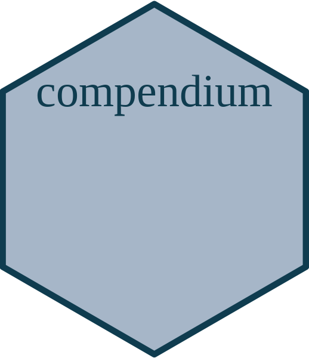

<!-- README.md is generated from README.Rmd. Please edit that file -->


```{r, include = FALSE}
knitr::opts_chunk$set(
  collapse = TRUE,
  comment = "#>",
  fig.path = "man/figures/",
  out.width = "100%"
)
```


# CEACWS <a href=''></a>


<!-- badges: start -->
[](https://choosealicense.com/licenses/gpl-2.0/)
[](https://lifecycle.r-lib.org/articles/stages.html#experimental)
[](#)

<!-- badges: end -->

This repository contains the *research compendium* for the project *"Characterizing the intensity and distribution of threats to seabirds in the Northwest Atlantic"*. It contains all the code required to import, format, and integrate the data needed for this project, as well as the code used to perform the analyses, figures, and the project report. 


### How to cite

Please cite this research compendium as follows: 

> **{{ PLEASE ADD A CITATION }}**


### Content

This research compendium is structured as follows: 

- [**data/**](https://github.com/user/repo/tree/main/data): contains the data for the assessment.
  - *aoi/*: spatial data on the area of interest
  - *basemap/*: spatial data used to generate the maps of the assessment
  - *config/*: configuration files with parameters used throughout the project (*e.g.* spatial projection, colors, bounding box, etc.)
  - *grid/*: study grid for the project
  - *pipedat/*: outputs from the [`pipedat`](https://github.com/Ecosystem-Assessments/pipedat) package workflow, if used.


- [**docs/**](https://github.com/user/repo/tree/main/docs): contains the html version of the report and other publications of the project

- [**figures/**](https://github.com/user/repo/tree/main/figures): contains all the figures generated for the project 

- [**man/**](https://github.com/user/repo/tree/main/man): contains the documentation for all R functions that are part of the research compendium

- [**output/**](https://github.com/user/repo/tree/main/output): contains all the outputs from the project

- [**R/**](https://github.com/user/repo/tree/main/R): contains R functions developped for the assessment
  
- [**pubs/**](https://github.com/user/repo/tree/main/report): contains the R Markdown version of the project report and other publications

- `DESCRIPTION`: research compendium metadata (authors, date, dependencies, etc.)
- `README.Rmd`: description of research compendium
